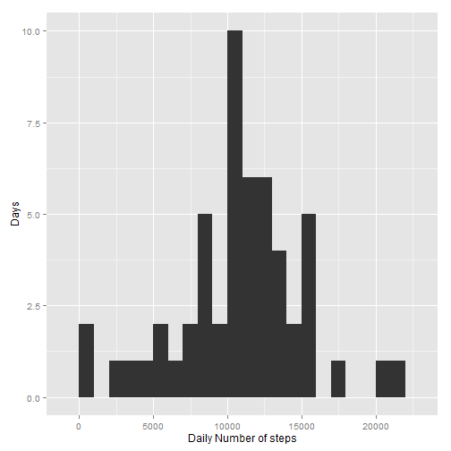
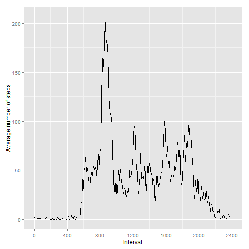
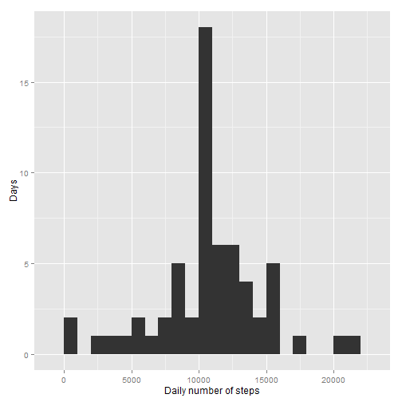
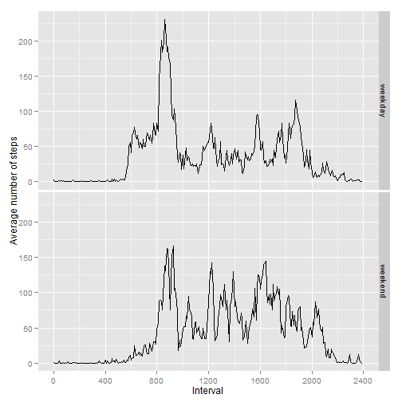

# Reproducible Research: Peer Assessment 1


## Loading and preprocessing the data

We calculate the fraction of hour to avoid holes on the graphs
such as between 0955 and 1000.


```r
df <- read.csv(unz("activity.zip", "activity.csv"))
df$date <- as.Date(df$date, "%Y-%m-%d")
df$hour <- df$interval %/% 100 + df$interval %% 100 / 60
```

## What is mean total number of steps taken per day?


```r
library(ggplot2)
df.total <- aggregate(steps~date, data=df, sum)
qplot(steps, data=df.total, binwidth=1000,
      xlab="Daily Number of steps", ylab="Days")
```

 

```r
mean(df.total$steps)
```

```
## [1] 10766
```

```r
median(df.total$steps)
```

```
## [1] 10765
```

## What is the average daily activity pattern?


```r
df.mean <- aggregate(steps~interval+hour, data=df, mean)
qplot(hour * 100, steps, data=df.mean, geom="line",
      xlab="Interval", ylab="Average number of steps") +
        scale_x_continuous(limits=c(0, 2400), breaks=seq(0, 2400, 400))
```

 

```r
df.mean$interval[which.max(df.mean$steps)]
```

```
## [1] 835
```

## Imputing missing values


```r
sum(is.na(df$steps))
```

```
## [1] 2304
```

We use the mean of 5-minute interval across all days
as a substitute for NA values.


```r
dff <- merge(df, df.mean, by=c("interval", "hour"), suffixes=c("", ".y"))
dff$steps[is.na(dff$steps)] <- dff$steps.y[is.na(dff$steps)]

dff.total <- aggregate(steps~date, data=dff, sum)
qplot(steps, data=dff.total, binwidth=1000,
      xlab="Daily number of steps", ylab="Days")
```

 

As the missing data span 8 whole days, we have only one change
on the histogram: the count of 10000 bin increases by 8.


```r
mean(dff.total$steps)
```

```
## [1] 10766
```

```r
median(dff.total$steps)
```

```
## [1] 10766
```

We see that our method does not affect the mean at all and shifts
the median toward the mean.

## Are there differences in activity patterns between weekdays and weekends?


```r
dff$dayType <- as.factor(c("weekend", "weekday",
                           "weekday", "weekday",
                           "weekday", "weekday",
                           "weekend")[as.POSIXlt(dff$date)$wday+1])
dff.mean <- aggregate(steps~interval+hour+dayType, data=dff, mean)
qplot(hour * 100, steps, data=dff.mean, facets=dayType~., geom="line",
      xlab="Interval", ylab="Average number of steps") +
        scale_x_continuous(limits=c(0, 2400), breaks=seq(0, 2400, 400))
```

 

We see that there is considerable difference between
weekday and weekend activity patterns.

